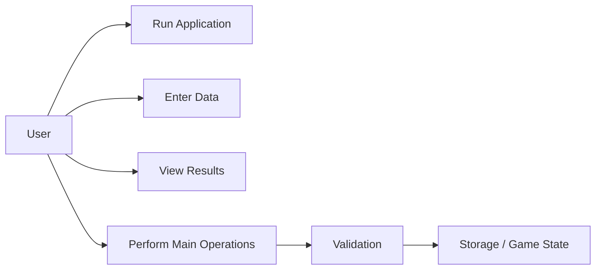
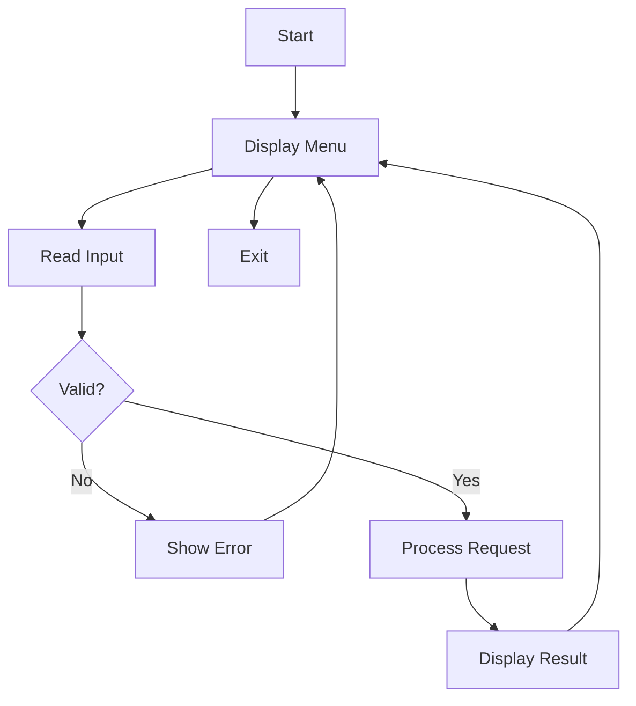
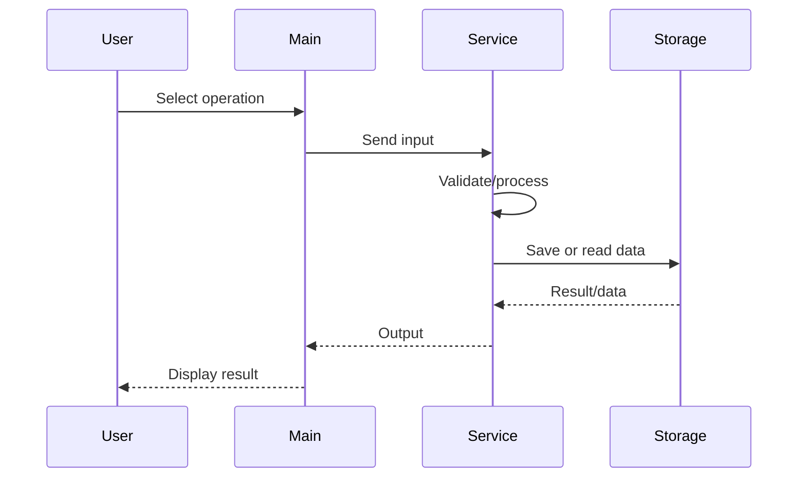
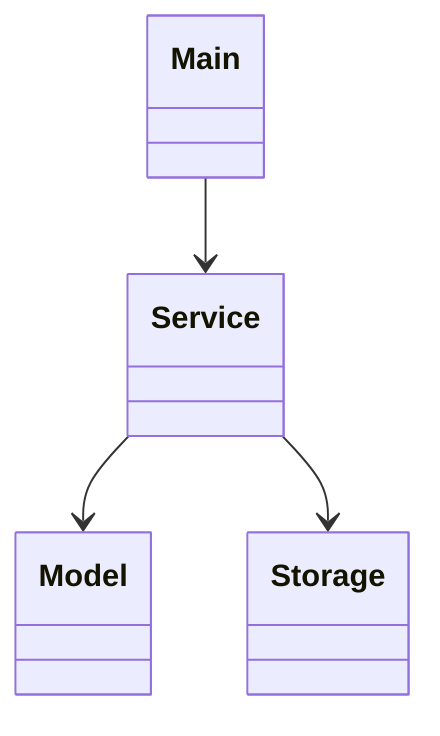

# Project Report — Rock Paper Scissors Game

## 1. Cover Page
**Project:** Rock Paper Scissors Game  
**Course:** Python / Programming Project  
**Platform:** VITyarthi Build Your Own Project  
**Implementation:** Python 3

## 2. Introduction
A menu-driven Python game with randomized computer moves, score tracking, persistent JSON storage, validation and automated tests.

## 3. Problem Statement
The project solves a defined small-scale real-world or simulation problem through a modular Python application. It accepts user input, processes it according to business rules and produces readable output.

## 4. Functional Requirements
1. Play unlimited rounds
2. Win/loss/draw calculation
3. Persistent scoreboard
4. Reset scoreboard
5. Input validation
6. Unit tests

## 5. Non-Functional Requirements
1. **Performance:** Menu operations should complete quickly for normal educational datasets.
2. **Security:** User input is validated; sensitive demonstrations should use test data only.
3. **Usability:** Clear menus and error messages are provided.
4. **Reliability:** Invalid input is handled without intentionally terminating the application.
5. **Maintainability:** Logic is separated into modules.
6. **Error handling:** File and user-input errors are handled where relevant.

## 6. System Architecture
```text
User
  |
  v
main.py / Console UI
  |
  v
Service or Game Logic
  |
  +--> Models / Validation
  |
  +--> JSON Storage (where applicable)
  |
  v
Output / Results
```

## 7. Design Diagrams

### Use Case Diagram


### Workflow Diagram


### Sequence Diagram


### Component / Class Diagram


## 8. Design Decisions & Rationale
- Console UI keeps the project easy to run in VS Code.
- Modules separate user interface, business logic, models and persistence.
- JSON is used because it is human-readable and requires no external database package.
- Validation prevents common invalid inputs.
- Unit tests verify important rules independently.

## 9. Implementation Details
The implementation uses functions, classes, lists/dictionaries, conditions, loops, exception handling, modules, file I/O and JSON serialization as appropriate to the project.

## 10. Screenshots / Results
Run the program in VS Code and capture:
1. Main menu.
2. A successful operation.
3. An invalid-input/error case.
4. Final result or report.

## 11. Testing Approach
Run:
```bash
python -m unittest
```
The included test file checks important business rules. Manual validation should also cover empty input, invalid numbers, unavailable records and boundary values.

## 12. Challenges Faced
- Designing separate modules without duplicating logic.
- Validating user input.
- Maintaining application state.
- Keeping stored data consistent after updates.

## 13. Learnings & Key Takeaways
- Modular programming improves maintainability.
- Validation improves reliability.
- Data structures are useful for representing real-world records.
- Testing catches errors before submission.
- Documentation makes a project easier to understand and evaluate.

## 14. Future Enhancements
- GUI using Tkinter or a web interface.
- SQLite/MySQL database.
- Login roles and audit logs.
- Export reports to CSV/PDF.
- More automated tests.
- GitHub Actions for continuous testing.

## 15. References
- Python Standard Library documentation.
- Course material and VITyarthi project guidelines.
- The project's own source code and test cases.
